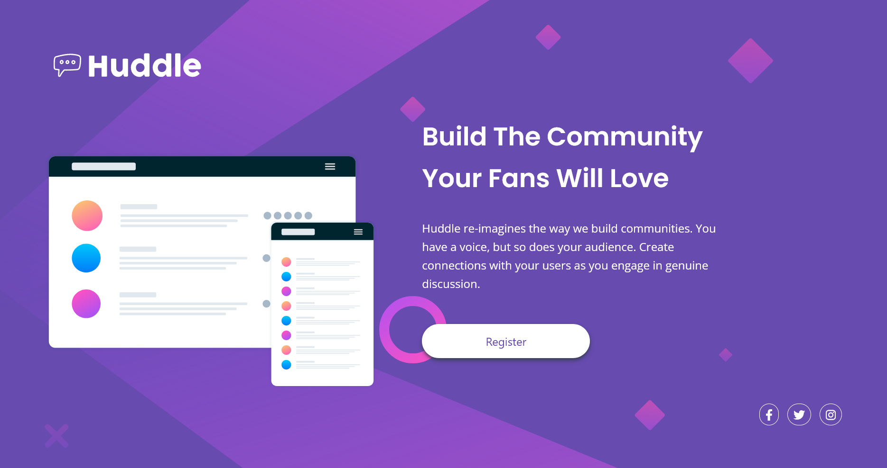

# Frontend Mentor - Huddle landing page with single introductory section solution

This is a solution to the [Huddle landing page with single introductory section challenge on Frontend Mentor](https://www.frontendmentor.io/challenges/huddle-landing-page-with-a-single-introductory-section-B_2Wvxgi0).

## Table of contents

- [Overview](#overview)
  - [The challenge](#the-challenge)
  - [Screenshot](#screenshot)
  - [Links](#links)
- [My process](#my-process)
  - [Built with](#built-with)
  - [What I learned](#what-i-learned)
  - [Continued development](#continued-development)
  - [Useful resources](#useful-resources)
- [Author](#author)
- [Acknowledgments](#acknowledgments)

## Overview

### The challenge

Users should be able to:

- View the optimal layout for the page depending on their device's screen size
- See hover states for all interactive elements on the page

### Screenshot



### Links

- Solution URL: [FrontendMentor.io](https://www.frontendmentor.io/solutions/huddle-landing-page-w-single-intro-section-with-html-taiwindcss-7ONnymWuw)
- Live Site URL: [Vercel](https://prj-13-huddle-landing-page-with-single-introductory-section.vercel.app/)

## My process

### Built with

- Semantic HTML5 markup
- Flexbox
- CSS Grid
- Mobile-first workflow
- [Vitejs](https://vitejs.dev/) - Frontend Development Framework
- [Tailwindcss](https://tailwindcss.com) - A utility-first CSS framework

### What I learned

Using FontAwesome icons loading them directly from internet: The kit must be generated from your account

```html
<script
  src="https://kit.fontawesome.com/1234567890.js"
  crossorigin="anonymous"
></script>
<footer
  class="flex items-center justify-center flex-nowrap gap-3 text-white mt-16 md:justify-end md:mt-4 lg:mt-2"
>
  <div class="">
    <div
      class="rounded-full border-[1px] border-white hover:border-softMagenta inline px-2 py-1 text-center hover:text-softMagenta hover:cursor-pointer"
    >
      <i class="fab fa-facebook-f"></i>
    </div>
  </div>
  <div>
    <div
      class="rounded-full border-[1px] border-white hover:border-softMagenta inline px-2 py-1 text-center hover:text-softMagenta hover:cursor-pointer"
    >
      <i class="fab fa-twitter"></i>
    </div>
  </div>
  <div>
    <div
      class="rounded-full border-[1px] border-white hover:border-softMagenta inline px-2 py-1 text-center hover:text-softMagenta hover:cursor-pointer"
    >
      <i class="fab fa-instagram"></i>
    </div>
  </div>
</footer>
```

Using multiple background images in Tailwindcss

```js
module.exports = {
  content: ["./index.html", "./src/**/*.{vue,js,ts,jsx,tsx}"],
  theme: {
    extend: {
      fontFamily: {
        openSans: ["Open Sans", "sans-serif"],
        poppins: ["Poppins", "sans-serif"],
      },
      colors: {
        violet: "hsl(257, 40%, 49%)",
        softMagenta: "hsl(300, 69%, 71%)",
      },
      backgroundImage: {
        mobile: "url('/images/bg-mobile.svg')",
        desktop: "url('/images/bg-desktop.svg')",
      },
    },
  },
  plugins: [],
};
```

### Continued development

Future projects will be developed using Vue.JS when interactivity must be included.

### Useful resources

- [TailwindCSS Directives](https://tailwindcss.com/docs/functions-and-directives) - Use of @apply directive
- [Customizing Colors in TailwindCSS](https://tailwindcss.com/docs/customizing-colors) - Adding personalized color names to be used in tailwindcss.
- [Customizing Fonts in TailwindCSS](https://tailwindcss.com/docs/font-family#using-custom-values) - Adding Google fonts to be used in tailwindcss.

## Author

- Website - [Gustavo Sanchez](https://www.gusanche.dev)
- Frontend Mentor - [@gusanchedev](https://www.frontendmentor.io/profile/gusanchedev)
- Github - [@gusanchedev](https://www.github.com/gusanchedev)
- Twitter - [@gusanchedev](https://www.twitter.com/gusanchedev)
- Linkedin - [gusanchedev](https://www.linkedin.com/in/gusanchedev/)

## Acknowledgments

Thanks to Mariapaz for being my friend and support 💙
